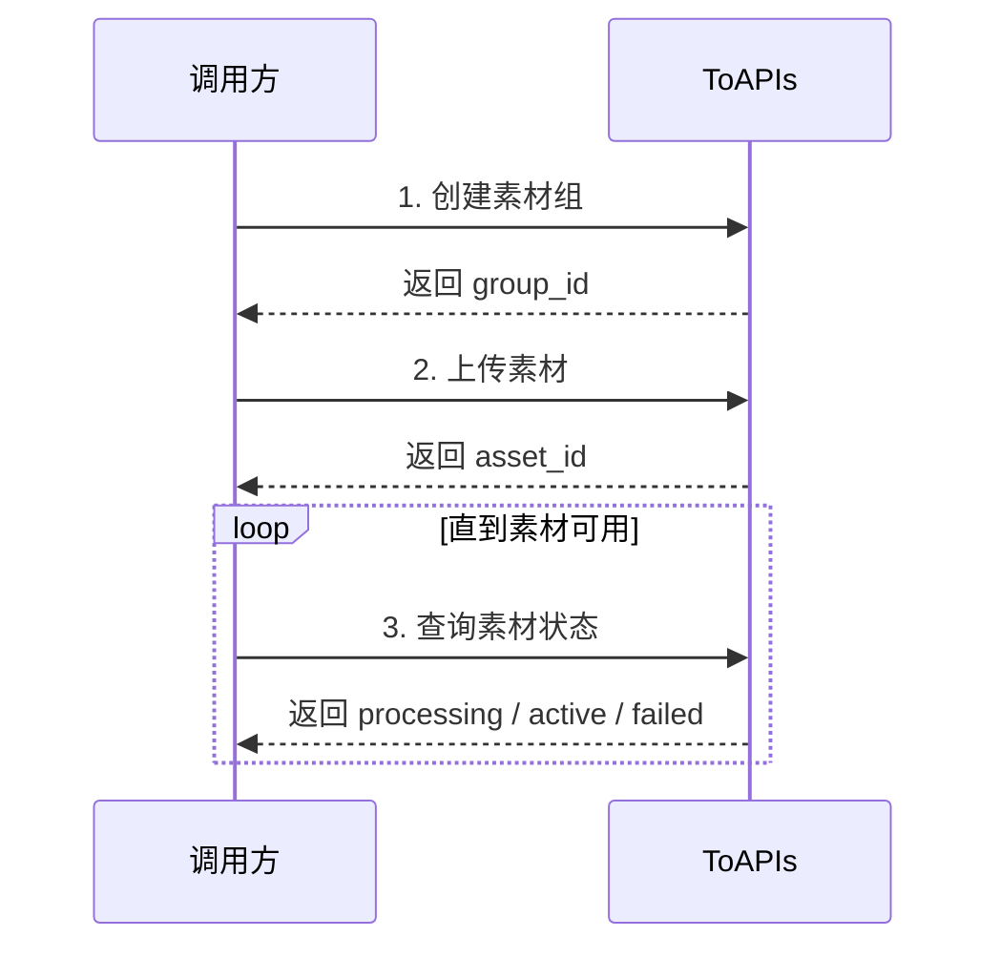

虚拟人像素材接口适用于你已经拥有可商用的虚拟角色素材，希望将这些素材提交到平台进行审核和处理，后续在 Seedance 2 视频生成中稳定复用的场景。

你可以用这组接口完成三件事：

- 创建虚拟人像素材组
- 上传图片、视频或音频素材
- 查询素材处理状态，并在生成接口中引用

在开始接入前，你需要准备：

- 可正常访问的公网素材 URL
- 你的 ToAPIs API Key
- 用于后续生成的视频提示词和素材引用方式

## Authorizations

<ParamField header="Authorization" type="string" required>
  所有请求均需要使用 Bearer Token 进行认证。

  获取 API Key：访问 [API Key 管理页面](https://toapis.com/console/token)

  ```
  Authorization: Bearer YOUR_API_KEY
  ```
</ParamField>

## 接入流程



如果你希望直接用命令行测试，推荐先准备这几个变量：

```bash
export TOAPIS_API_KEY="你的 API Key"
export IMAGE_URL="https://files.example.com/avatar-full-body.jpg"
```

如果你手里是本地图片而不是公网 URL，请先调用 [上传图片接口](../../uploads/images) 拿到可访问的 URL，再把该 URL 作为下文的 `source_url` / `IMAGE_URL`。

## 第一步：创建素材组

当你准备上传一组属于同一虚拟角色的素材时，先创建一个素材组。后续你可以把同一角色的不同素材放到同一个组里管理。

调用接口：

- `POST /v1/videos/doubao-seedance-2-0/private-avatar/groups`

这个接口的作用：

- 创建一个新的虚拟人像素材组
- 返回后续上传素材要使用的 `group_id`

<RequestExample>
```bash cURL
curl --request POST \
  --url https://toapis.com/v1/videos/doubao-seedance-2-0/private-avatar/groups \
  --header "Authorization: Bearer $TOAPIS_API_KEY" \
  --header 'Content-Type: application/json' \
  --data '{
    "name": "brand-avatar-group",
    "description": "品牌虚拟人像素材组"
  }'
```

```bash cURL（推荐：记录返回值）
curl -sS --request POST \
  --url https://toapis.com/v1/videos/doubao-seedance-2-0/private-avatar/groups \
  --header "Authorization: Bearer $TOAPIS_API_KEY" \
  --header 'Content-Type: application/json' \
  --data '{
    "name": "brand-avatar-group",
    "description": "品牌虚拟人像素材组"
  }'

# 记录响应中的：
# data.group_id
```
</RequestExample>

<ResponseExample>
```json
{
  "success": true,
  "message": "",
  "data": {
    "group_id": "pg_01KXXXXXXX",
    "name": "brand-avatar-group",
    "description": "品牌虚拟人像素材组"
  }
}
```
</ResponseExample>

## 第二步：上传素材

创建好素材组后，你就可以向该组提交素材。每次请求上传一个素材。

调用接口：

- `POST /v1/videos/doubao-seedance-2-0/private-avatar/assets`

这个接口的作用：

- 向指定的素材组提交一个素材
- 返回 `asset_id`
- 素材会进入异步处理流程

支持的 `asset_type`：

- `image`
- `video`
- `audio`

客户真正需要关心的字段只有这些：

- `group_id`：素材组 ID
- `asset_type`：素材类型
- `source_url`：素材公网 URL
- `name`：素材名称，可选
- `description`：素材描述，可选

<RequestExample>
```bash cURL
curl --request POST \
  --url https://toapis.com/v1/videos/doubao-seedance-2-0/private-avatar/assets \
  --header "Authorization: Bearer $TOAPIS_API_KEY" \
  --header 'Content-Type: application/json' \
  --data '{
    "group_id": "pg_01KXXXXXXX",
    "asset_type": "image",
    "source_url": "'"$IMAGE_URL"'",
    "name": "full-body"
  }'
```

```bash cURL（推荐：紧接上一步执行）
curl -sS --request POST \
  --url https://toapis.com/v1/videos/doubao-seedance-2-0/private-avatar/assets \
  --header "Authorization: Bearer $TOAPIS_API_KEY" \
  --header 'Content-Type: application/json' \
  --data '{
    "group_id": "pg_01KXXXXXXX",
    "asset_type": "image",
    "source_url": "'"$IMAGE_URL"'",
    "name": "full-body"
  }'

# 记录响应中的：
# data.asset_id
# data.asset_url
# data.status
```
</RequestExample>

<ResponseExample>
```json
{
  "success": true,
  "message": "",
  "data": {
    "asset_id": "pa_01KYYYYYYY",
    "asset_url": "asset://pa_01KYYYYYYY",
    "group_id": "pg_01KXXXXXXX",
    "asset_type": "image",
    "source_url": "https://files.example.com/avatar-full-body.jpg",
    "status": "processing",
    "name": "full-body"
  }
}
```
</ResponseExample>

这里有两个容易混淆的值：

- `asset_id`：素材 ID，后续查询素材状态时使用
- `asset_url`：素材引用地址，后续视频生成时直接使用，例如 `asset://pa_01KYYYYYYY`

## 第三步：查询素材状态

素材提交后不会立刻可用。你需要轮询查询素材状态，直到它变成 `active`。

调用接口：

- `GET /v1/videos/doubao-seedance-2-0/private-avatar/assets/{asset_id}`

这个接口的作用：

- 查询指定素材当前状态
- 判断该素材是否已经可以在视频生成中使用

<RequestExample>
```bash cURL
curl --request GET \
  --url https://toapis.com/v1/videos/doubao-seedance-2-0/private-avatar/assets/pa_01KYYYYYYY \
  --header "Authorization: Bearer $TOAPIS_API_KEY"
```

```bash cURL（轮询示例）
curl -sS --request GET \
  --url https://toapis.com/v1/videos/doubao-seedance-2-0/private-avatar/assets/pa_01KYYYYYYY \
  --header "Authorization: Bearer $TOAPIS_API_KEY"

# 查看响应中的：
# data.status
# 当 data.status = active 时，才可以用于视频生成
```
</RequestExample>

<ResponseExample>
```json
{
  "success": true,
  "message": "",
  "data": {
    "asset_id": "pa_01KYYYYYYY",
    "asset_url": "asset://pa_01KYYYYYYY",
    "group_id": "pg_01KXXXXXXX",
    "asset_type": "image",
    "source_url": "https://files.example.com/avatar-full-body.jpg",
    "status": "active"
  }
}
```
</ResponseExample>

## 素材要求与最佳实践

为了提高审核通过率和后续生成效果，建议你优先准备高质量、无遮挡、主体明确的素材。

推荐做法：

- 使用稳定可访问的公网 URL，不要使用临时链接
- 同一虚拟角色的素材尽量放在同一素材组中
- 优先准备全身图和面部特写图，方便后续生成时保持形象一致
- 尽量避免模糊、强遮挡、多人同框、强压缩素材

## 状态说明

<ResponseField name="processing" type="string">
  素材已提交，平台正在审核和处理，暂时还不能用于生成。
</ResponseField>

<ResponseField name="active" type="string">
  素材已可用，可以在视频生成接口中引用。
</ResponseField>

<ResponseField name="failed" type="string">
  素材处理失败。建议检查素材内容、清晰度、访问 URL 是否有效，然后重新提交。
</ResponseField>

## 在视频生成中的使用方式

当素材状态变为 `active` 后，你可以在视频生成接口中使用 `asset://<ASSET_ID>` 来引用它。

调用接口：

- `POST /v1/videos/generations`

在生成请求里，把已经可用的素材写成 `asset://<ASSET_ID>` 即可。也就是说，如果第二步返回了：

```json
{
  "asset_id": "pa_01KYYYYYYY",
  "asset_url": "asset://pa_01KYYYYYYY"
}
```

那么你在视频生成接口里可以直接使用：

- `asset://pa_01KYYYYYYY`
- 或者直接使用响应里的 `asset_url`

```json
{
  "model": "doubao-seedance-2-0",
  "prompt": "让图片1中的角色站在城市夜景中缓慢转身，镜头轻微推进",
  "image_with_roles": [
    {
      "url": "asset://pa_01KYYYYYYY",
      "role": "reference_image"
    }
  ]
}
```

## 完整 cURL 串联示例

下面是一套按顺序执行的最短流程，适合快速验证接入是否正常：

```bash cURL
# 1. 创建素材组
curl -sS --request POST \
  --url https://toapis.com/v1/videos/doubao-seedance-2-0/private-avatar/groups \
  --header "Authorization: Bearer $TOAPIS_API_KEY" \
  --header 'Content-Type: application/json' \
  --data '{
    "name": "brand-avatar-group",
    "description": "品牌虚拟人像素材组"
  }'

# 从返回中记录：
# GROUP_ID="pg_01KXXXXXXX"

# 2. 上传素材
curl -sS --request POST \
  --url https://toapis.com/v1/videos/doubao-seedance-2-0/private-avatar/assets \
  --header "Authorization: Bearer $TOAPIS_API_KEY" \
  --header 'Content-Type: application/json' \
  --data '{
    "group_id": "pg_01KXXXXXXX",
    "asset_type": "image",
    "source_url": "'"$IMAGE_URL"'",
    "name": "full-body"
  }'

# 从返回中记录：
# ASSET_ID="pa_01KYYYYYYY"
# ASSET_URL="asset://pa_01KYYYYYYY"

# 3. 查询素材状态，直到 status=active
curl -sS --request GET \
  --url https://toapis.com/v1/videos/doubao-seedance-2-0/private-avatar/assets/pa_01KYYYYYYY \
  --header "Authorization: Bearer $TOAPIS_API_KEY"
```

## 常见注意事项

- 上传成功不等于素材可立即使用，必须等到 `status=active`
- 一个素材组适合同一虚拟角色，不建议把多个无关角色混在同一组
- 素材 URL 需要保持可访问，否则会导致处理失败
- 如果你只拿到了 `group_id`，还没有拿到 `asset_id`，说明你还没完成“上传素材”这一步
- 生成视频时使用的是 `asset_url`，也就是 `asset://<ASSET_ID>`，不是原始 `source_url`
