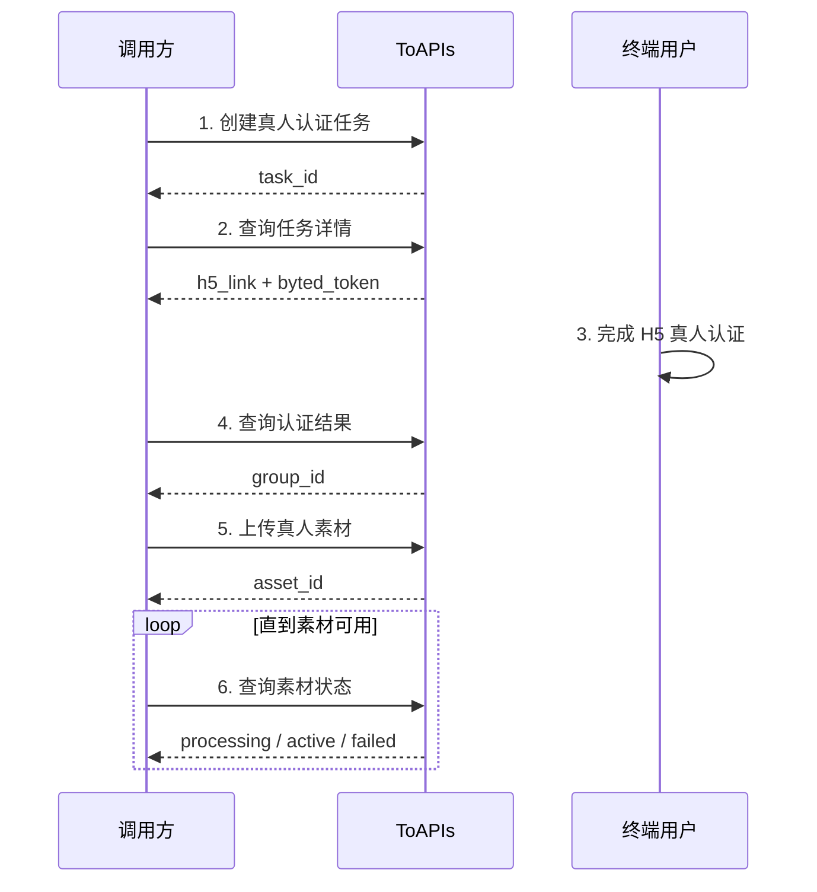

真人人像素材接口适用于你希望上传真实人物素材，并在合规前提下用于视频生成的场景。和虚拟人像不同，真人人像素材在提交前需要先完成真人认证。

你可以用这组接口完成完整流程：

- 创建真人认证任务
- 获取 H5 认证链接
- 查询认证结果，拿到素材组 ID
- 上传真人素材
- 查询素材状态并在生成中使用

在开始接入前，你需要准备：

- 一个可接收结果参数的 `callback_url`
- 可正常访问的公网素材 URL
- 你的 ToAPIs API Key

## Authorizations

<ParamField header="Authorization" type="string" required>
  所有请求均需要使用 Bearer Token 进行认证。

  获取 API Key：访问 [API Key 管理页面](https://toapis.com/console/token)

  ```
  Authorization: Bearer YOUR_API_KEY
  ```
</ParamField>

## 接入流程



## 第一步：创建真人认证任务

你需要先创建一个真人认证任务。创建成功后，平台会为你准备后续查询所需的任务信息。

调用接口：

- `POST /v1/videos/doubao-seedance-2-0/real-avatar/verify-tasks`

这个接口的作用：

- 创建一个新的真人认证任务
- 返回 `task_id`
- 后续你需要用 `task_id` 查询认证详情

<RequestExample>
```bash cURL
curl --request POST \
  --url https://toapis.com/v1/videos/doubao-seedance-2-0/real-avatar/verify-tasks \
  --header 'Authorization: Bearer <token>' \
  --header 'Content-Type: application/json' \
  --data '{
    "callback_url": "https://your-app.example.com/doubao/callback",
    "locale": "zh",
    "biz_id": "user-123"
  }'
```
</RequestExample>

## 第二步：查询认证任务详情

创建任务后，使用 `task_id` 查询详情，拿到 `h5_link`、`byted_token` 和 `expires_at`。

调用接口：

- `GET /v1/videos/doubao-seedance-2-0/real-avatar/verify-tasks/{task_id}`

这个接口的作用：

- 查询真人认证任务详情
- 获取终端用户要打开的 `h5_link`
- 获取后续查询认证结果要用的 `byted_token`

这里有一个非常重要的区别：

- `status=completed` 仅表示认证会话已经创建成功
- 不表示真人认证已经通过

<ResponseExample>
```json
{
  "success": true,
  "message": "",
  "data": {
    "task_id": "tsk_dav_01K...",
    "status": "completed",
    "callback_url": "https://your-app.example.com/doubao/callback",
    "locale": "zh",
    "biz_id": "user-123",
    "byted_token": "202603311449168C23BA26**************",
    "h5_link": "https://h5.example.com/...",
    "expires_at": 1770000123,
    "created_at": 1770000003,
    "updated_at": 1770000004
  }
}
```
</ResponseExample>

## 第三步：用户完成 H5 真人认证

将第二步拿到的 `h5_link` 提供给终端用户。用户完成认证后，你需要从 `callback_url` 回调参数中读取：

- `resultCode`
- `bytedToken`

其中：

- `resultCode=10000` 表示认证成功

这一阶段不需要额外调用素材接口，但你需要保存好：

- `resultCode`
- `bytedToken`

## 第四步：查询认证结果

当用户完成真人认证后，继续调用认证结果接口，获得后续上传素材需要使用的 `group_id`。

调用接口：

- `GET /v1/videos/doubao-seedance-2-0/real-avatar/verify-results`

可用查询参数：

- `task_id`
- `byted_token`
- `result_code` 推荐一并传入

这个接口的作用：

- 确认认证是否已经通过
- 获取后续上传真人素材要使用的 `group_id`

推荐把回调里的 `resultCode=10000` 一起传入，便于你的业务流程判断。

<RequestExample>
```bash cURL
curl --request GET \
  --url 'https://toapis.com/v1/videos/doubao-seedance-2-0/real-avatar/verify-results?task_id=tsk_dav_01K...&result_code=10000' \
  --header 'Authorization: Bearer <token>'
```
</RequestExample>

<ResponseExample>
```json
{
  "success": true,
  "message": "",
  "data": {
    "task_id": "tsk_dav_01K...",
    "byted_token": "202603311449168C23BA26**************",
    "result_code": "10000",
    "verify_status": "verified",
    "group_id": "group-20260331145705-*****"
  }
}
```
</ResponseExample>

## 第五步：上传真人人像素材

当且仅当：

- `verify_status=verified`
- 并且已经拿到 `group_id`

你才应该继续上传真人素材。

`group_id` 必须来自认证成功结果，不能手动伪造，也不能复用其他用户的真人素材组。

调用接口：

- `POST /v1/videos/doubao-seedance-2-0/real-avatar/assets`

这个接口的作用：

- 向认证通过后的真人素材组上传一个素材
- 返回 `asset_id`
- 素材会进入异步处理流程

<RequestExample>
```bash cURL
curl --request POST \
  --url https://toapis.com/v1/videos/doubao-seedance-2-0/real-avatar/assets \
  --header 'Authorization: Bearer <token>' \
  --header 'Content-Type: application/json' \
  --data '{
    "group_id": "group-20260331145705-*****",
    "asset_type": "image",
    "source_url": "https://files.example.com/real-person-front.jpg",
    "name": "front"
  }'
```
</RequestExample>

## 第六步：查询素材状态

真人素材提交后同样需要等待处理完成。你需要轮询：

`GET /v1/videos/doubao-seedance-2-0/real-avatar/assets/{asset_id}`

直到 `status=active`。

这个接口的作用：

- 查询指定真人素材当前状态
- 判断该素材是否已经可以在视频生成中使用

## 状态说明

<ResponseField name="processing" type="string">
  素材已提交，正在审核和处理，暂时还不能用于生成。
</ResponseField>

<ResponseField name="active" type="string">
  素材已可用，可以在视频生成接口中引用。
</ResponseField>

<ResponseField name="failed" type="string">
  素材处理失败。建议检查认证状态、素材 URL、素材内容与认证人物的一致性后重新提交。
</ResponseField>

## 在视频生成中的使用方式

当素材状态变为 `active` 后，你可以在视频生成接口中通过 `asset://<ASSET_ID>` 引用：

调用接口：

- `POST /v1/videos/generations`

```json
{
  "model": "doubao-seedance-2-0",
  "prompt": "让图片1中的人物在室内镜头前自然微笑，并做轻微点头动作",
  "image_with_roles": [
    {
      "url": "asset://asset-20260318071009-*****",
      "role": "reference_image"
    }
  ]
}
```

## 常见失败原因

- H5Link 已过期，用户未在有效时间内完成认证
- 用户尚未完成真人认证，就提前查询结果
- 认证已完成，但你的业务侧没有继续查询认证结果获取 `group_id`
- 上传的素材与认证人物不一致，导致审核失败
- 素材 URL 无法访问或素材质量过低
