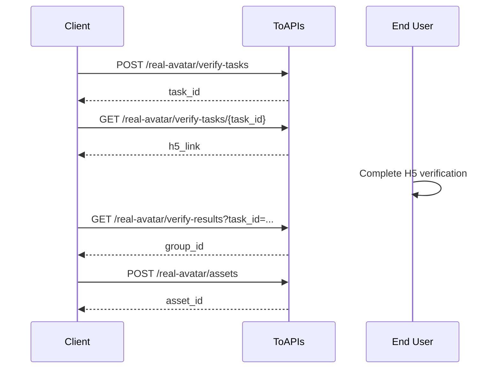

- Follows an APIMart-style task flow
- `verify-tasks.completed` means the verification session was created, not that the user has passed verification
- The returned H5 link expires after `120` seconds

## Authorizations

<ParamField header="Authorization" type="string" required>
  All requests require Bearer Token authentication.
</ParamField>

## Workflow



## 1. Create Verification Task

Call this endpoint:

- `POST /v1/videos/doubao-seedance-2-0/real-avatar/verify-tasks`

What it does:

- Creates a new real-person verification task
- Returns a `task_id`
- You will use that `task_id` to fetch verification details

<RequestExample>
```bash cURL
curl --request POST \
  --url https://toapis.com/v1/videos/doubao-seedance-2-0/real-avatar/verify-tasks \
  --header 'Authorization: Bearer <token>' \
  --header 'Content-Type: application/json' \
  --data '{
    "callback_url": "https://your-app.example.com/doubao/callback",
    "locale": "zh",
    "biz_id": "user-123"
  }'
```
</RequestExample>

## 2. Get Verification Task Details

Call this endpoint:

- `GET /v1/videos/doubao-seedance-2-0/real-avatar/verify-tasks/{task_id}`

What it does:

- Returns the verification task details
- Gives you the `h5_link` for the end user
- Gives you the `byted_token` used in the next step

This endpoint returns `h5_link`, `byted_token`, and `expires_at`.

## 3. Get Verification Result

Call this endpoint:

- `GET /v1/videos/doubao-seedance-2-0/real-avatar/verify-results`

Available query parameters:

- `task_id`
- `byted_token`
- `result_code` is recommended

What it does:

- Confirms whether verification has passed
- Returns the `group_id` required for asset upload

After the user completes the H5 flow, read `resultCode` and `bytedToken` from your callback URL.

Recommended query:

```bash
curl --request GET \
  --url 'https://toapis.com/v1/videos/doubao-seedance-2-0/real-avatar/verify-results?task_id=tsk_dav_01K...&result_code=10000' \
  --header 'Authorization: Bearer <token>'
```

Only continue when:

- `verify_status=verified`
- `group_id` is present

## 4. Upload Real Avatar Asset

Call this endpoint:

- `POST /v1/videos/doubao-seedance-2-0/real-avatar/assets`

What it does:

- Uploads one real-avatar asset into the verified group
- Returns an `asset_id`
- Starts asynchronous processing

The `group_id` must come from a verified real-avatar task owned by the current user.  
It cannot be manually fabricated or reused across users.

## 5. Get Asset Status

Call this endpoint:

- `GET /v1/videos/doubao-seedance-2-0/real-avatar/assets/{asset_id}`

What it does:

- Returns the current asset status
- Tells you whether the asset is ready for video generation

Poll `GET /real-avatar/assets/{asset_id}` until `status=active`.

## Use In Video Generation

Call this endpoint:

- `POST /v1/videos/generations`

```json
{
  "image_with_roles": [
    {
      "url": "asset://asset-20260318071009-*****",
      "role": "reference_image"
    }
  ]
}
```
