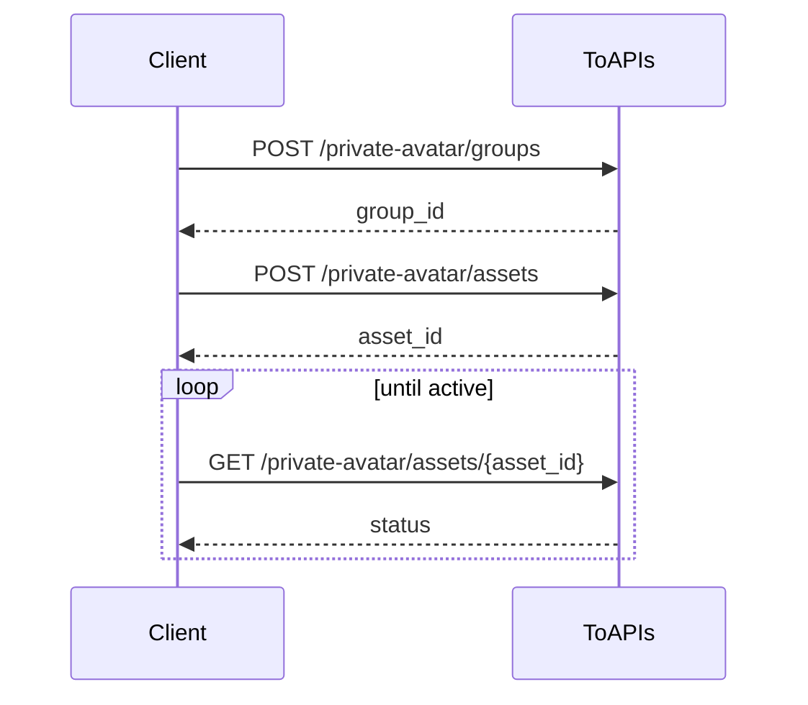

- Exposes only the minimum user-facing workflow
- Asset ingestion accepts public `source_url` only
- Only assets with `status=active` can be used for generation

## Authorizations

<ParamField header="Authorization" type="string" required>
  All requests require Bearer Token authentication.
</ParamField>

## Workflow



## 1. Create Asset Group

Call this endpoint:

- `POST /v1/videos/doubao-seedance-2-0/private-avatar/groups`

What it does:

- Creates a new virtual avatar asset group
- Returns the `group_id` used in the upload step

<RequestExample>
```bash cURL
curl --request POST \
  --url https://toapis.com/v1/videos/doubao-seedance-2-0/private-avatar/groups \
  --header 'Authorization: Bearer <token>' \
  --header 'Content-Type: application/json' \
  --data '{
    "name": "brand-avatar-group",
    "description": "Virtual avatar asset group"
  }'
```
</RequestExample>

## 2. Upload Asset

Call this endpoint:

- `POST /v1/videos/doubao-seedance-2-0/private-avatar/assets`

What it does:

- Uploads one asset into the target group
- Returns an `asset_id`
- Starts asynchronous processing

Supported `asset_type` values:

- `image`
- `video`
- `audio`

`source_url` must be a publicly reachable `http/https` URL.

<RequestExample>
```bash cURL
curl --request POST \
  --url https://toapis.com/v1/videos/doubao-seedance-2-0/private-avatar/assets \
  --header 'Authorization: Bearer <token>' \
  --header 'Content-Type: application/json' \
  --data '{
    "group_id": "group-20260318033332-*****",
    "asset_type": "image",
    "source_url": "https://files.example.com/avatar-full-body.jpg",
    "name": "full-body"
  }'
```
</RequestExample>

## 3. Get Asset ステータス

Call this endpoint:

- `GET /v1/videos/doubao-seedance-2-0/private-avatar/assets/{asset_id}`

What it does:

- Returns the current asset status
- Tells you whether the asset is ready for video generation

Poll this endpoint until `status=active`.

<ResponseExample>
```json
{
  "success": true,
  "message": "",
  "data": {
    "asset_id": "asset-20260318071009-*****",
    "group_id": "group-20260318033332-*****",
    "asset_type": "image",
    "source_url": "https://ark-media-asset.example.com/xxx",
    "status": "active",
  }
}
```
</ResponseExample>

## Use In 動画生成

Call this endpoint:

- `POST /v1/videos/generations`

Once the asset becomes `active`, use `asset://<ASSET_ID>` in your generation request.

Once the asset becomes `active`, reference it with:

```json
{
  "image_with_roles": [
    {
      "url": "asset://asset-20260318071009-*****",
      "role": "reference_image"
    }
  ]
}
```
