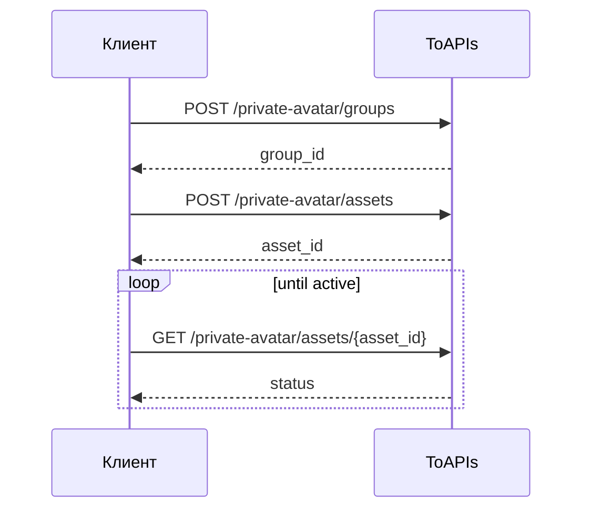

- Открыт только минимальный пользовательский workflow
- Загрузка принимает только публичный `source_url`
- Для генерации можно использовать только ассеты со `status=active`

## Authorizations

<ParamField header="Authorization" type="string" required>
  Все запросы требуют Bearer Token аутентификацию.
</ParamField>

## Workflow



## 1. Создание группы ассетов

Вызовите этот интерфейс:

- `POST /v1/videos/doubao-seedance-2-0/private-avatar/groups`

Что делает этот интерфейс:

- Создает новую группу материалов виртуального аватара
- Возвращает `group_id`, который понадобится на шаге загрузки

```bash
curl --request POST \
  --url https://toapis.com/v1/videos/doubao-seedance-2-0/private-avatar/groups \
  --header 'Authorization: Bearer <token>' \
  --header 'Content-Type: application/json' \
  --data '{
    "name": "brand-avatar-group",
    "description": "Группа ассетов виртуального аватара"
  }'
```

## 2. Загрузка ассета

Вызовите этот интерфейс:

- `POST /v1/videos/doubao-seedance-2-0/private-avatar/assets`

Что делает этот интерфейс:

- Загружает один материал в выбранную группу
- Возвращает `asset_id`
- Запускает асинхронную обработку

Поддерживаемые `asset_type`:

- `image`
- `video`
- `audio`

`source_url` должен быть публичным `http/https` URL.

## 3. Проверка статуса ассета

Вызовите этот интерфейс:

- `GET /v1/videos/doubao-seedance-2-0/private-avatar/assets/{asset_id}`

Что делает этот интерфейс:

- Возвращает текущий статус ассета
- Позволяет понять, готов ли ассет для генерации видео

Выполняйте polling до тех пор, пока `status` не станет `active`.

## Использование в генерации видео

Вызовите этот интерфейс:

- `POST /v1/videos/generations`

Когда материал станет `active`, используйте `asset://<ASSET_ID>` в запросе генерации.

```json
{
  "image_with_roles": [
    {
      "url": "asset://asset-20260318071009-*****",
      "role": "reference_image"
    }
  ]
}
```
