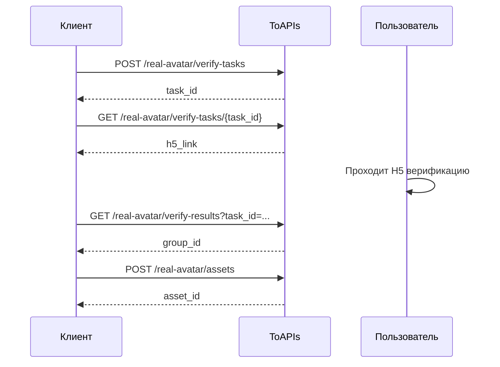

- Поток построен по модели APIMart
- `verify-tasks.completed` означает только успешное создание сессии, а не успешную верификацию пользователя
- H5 ссылка действует `120` секунд

## Authorizations

<ParamField header="Authorization" type="string" required>
  Все запросы требуют Bearer Token аутентификацию.
</ParamField>

## Workflow



## 1. Создание задачи верификации

Вызовите этот интерфейс:

- `POST /v1/videos/doubao-seedance-2-0/real-avatar/verify-tasks`

Что делает этот интерфейс:

- Создает новую задачу верификации реального человека
- Возвращает `task_id`
- Этот `task_id` нужен для получения деталей задачи

```bash
curl --request POST \
  --url https://toapis.com/v1/videos/doubao-seedance-2-0/real-avatar/verify-tasks \
  --header 'Authorization: Bearer <token>' \
  --header 'Content-Type: application/json' \
  --data '{
    "callback_url": "https://your-app.example.com/doubao/callback",
    "locale": "zh",
    "biz_id": "user-123"
  }'
```

## 2. Получение деталей задачи

Вызовите этот интерфейс:

- `GET /v1/videos/doubao-seedance-2-0/real-avatar/verify-tasks/{task_id}`

Что делает этот интерфейс:

- Возвращает детали задачи верификации
- Дает `h5_link` для конечного пользователя
- Дает `byted_token`, который понадобится на следующем шаге

Этот запрос возвращает `h5_link`, `byted_token` и `expires_at`.

## 3. Получение результата верификации

Вызовите этот интерфейс:

- `GET /v1/videos/doubao-seedance-2-0/real-avatar/verify-results`

Доступные query-параметры:

- `task_id`
- `byted_token`
- `result_code` рекомендуется передавать вместе с запросом

Что делает этот интерфейс:

- Подтверждает, прошла ли верификация успешно
- Возвращает `group_id`, необходимый для загрузки материалов

После завершения H5 сценария прочитайте `resultCode` и `bytedToken` из callback URL.

Продолжайте только если:

- `verify_status=verified`
- присутствует `group_id`

## 4. Загрузка материала реального аватара

Вызовите этот интерфейс:

- `POST /v1/videos/doubao-seedance-2-0/real-avatar/assets`

Что делает этот интерфейс:

- Загружает один материал в подтвержденную группу
- Возвращает `asset_id`
- Запускает асинхронную обработку

`group_id` должен происходить из успешно подтвержденной задачи реального аватара текущего пользователя.  
Нельзя подставлять произвольный `group_id` или переиспользовать группу другого пользователя.

## 5. Проверка статуса материала

Вызовите этот интерфейс:

- `GET /v1/videos/doubao-seedance-2-0/real-avatar/assets/{asset_id}`

Что делает этот интерфейс:

- Возвращает текущий статус материала
- Позволяет понять, готов ли материал к использованию в генерации видео

Выполняйте polling `GET /real-avatar/assets/{asset_id}` до `status=active`.

## Использование в генерации видео

Вызовите этот интерфейс:

- `POST /v1/videos/generations`

```json
{
  "image_with_roles": [
    {
      "url": "asset://asset-20260318071009-*****",
      "role": "reference_image"
    }
  ]
}
```
