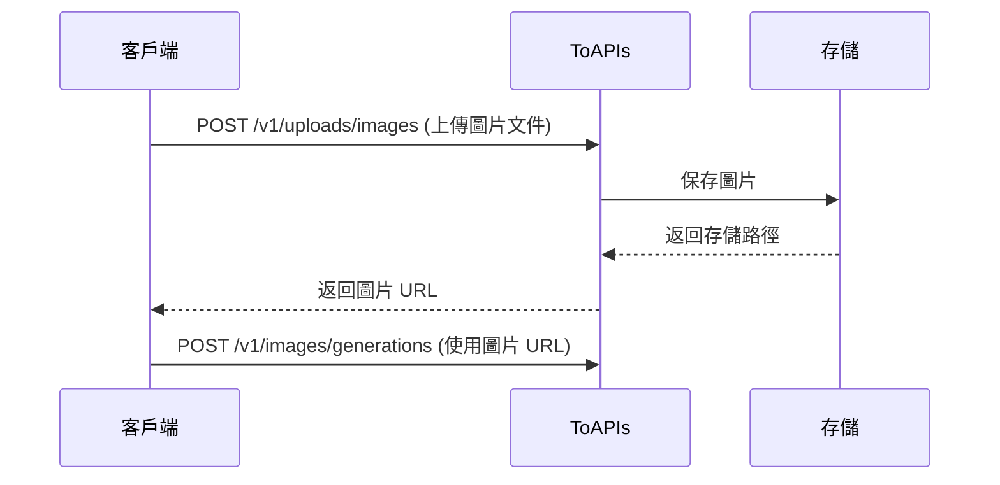

<Note>
**文檔 Playground 不支持文件上傳**：請使用下方的 cURL、Python 或 JavaScript 代碼示例進行測試。
</Note>

<Warning>
**重要變更**：爲了更好的性能和成本控制，我們不再支持在生成接口中直接傳入 base64 圖片數據。請使用本接口上傳圖片，獲取 URL 後再調用生成接口。
</Warning>

## 爲什麼需要先上傳圖片？

1. **性能優化** - base64 編碼會使數據膨脹 33%，先上傳可顯著減少請求體大小
2. **複用圖片** - 上傳一次，URL 可多次使用，無需重複傳輸

## 使用流程



## Authorizations

<ParamField header="Authorization" type="string" required>
  使用 Bearer Token 進行認證

  獲取 API Key：訪問 [API Key 管理頁面](https://toapis.com/console/token)

  ```
  Authorization: Bearer YOUR_API_KEY
  ```
</ParamField>

## Body

<ParamField body="file" type="file" required>
  圖片文件

  **支持的格式：**
  - JPEG (.jpg, .jpeg)
  - PNG (.png)
  - WebP (.webp)
  - GIF (.gif)

  **限制：**
  - 最大文件大小：10MB
</ParamField>

<ParamField body="purpose" type="string">
  上傳目的（可選）

  默認值：`generation`
</ParamField>

## Response

<ResponseField name="success" type="boolean">
  請求是否成功
</ResponseField>

<ResponseField name="data" type="object">
  <Expandable title="返回數據">
    <ResponseField name="id" type="string">
      上傳記錄 ID，用於追蹤
    </ResponseField>

    <ResponseField name="url" type="string">
      圖片的公開訪問 URL，可直接用於生成接口
    </ResponseField>

    <ResponseField name="mime_type" type="string">
      圖片的 MIME 類型，如 `image/jpeg`
    </ResponseField>

    <ResponseField name="size" type="integer">
      圖片文件大小（字節）
    </ResponseField>
  </Expandable>
</ResponseField>

<RequestExample>
```bash cURL
curl --request POST \
  --url https://toapis.com/v1/uploads/images \
  --header 'Authorization: Bearer <token>' \
  --form 'file=@/path/to/your/image.jpg'
```

```python Python
import requests

# 上傳圖片
with open('image.jpg', 'rb') as f:
    response = requests.post(
        "https://toapis.com/v1/uploads/images",
        headers={
            "Authorization": "Bearer your-ToAPIs-key"
        },
        files={
            "file": f
        }
    )

result = response.json()
image_url = result['data']['url']
print(f"圖片 URL: {image_url}")

# 使用上傳的圖片進行生成
response = requests.post(
    "https://toapis.com/v1/images/generations",
    headers={
        "Authorization": "Bearer your-ToAPIs-key",
        "Content-Type": "application/json"
    },
    json={
        "model": "gemini-3-pro-image-preview",
        "prompt": "基於這張圖片創作變體",
        "image_urls": [{"url": image_url}]
    }
)
```

```javascript JavaScript
(async () => {
const fileInput = document.createElement('input');
fileInput.type = 'file';
fileInput.accept = 'image/*';
fileInput.click();
await new Promise(resolve => fileInput.onchange = resolve);

// 上傳圖片（已驗證成功）
const formData = new FormData();
formData.append('file', fileInput.files[0]);

const uploadResponse = await fetch('https://toapis.com/v1/uploads/images', {
  method: 'POST',
  headers: {
    'Authorization': 'Bearer your-ToAPIs-key' // 替換爲你的實際API密鑰
  },
  body: formData
});

const uploadResult = await uploadResponse.json();
const imageUrl = uploadResult.data.url;
console.log(`圖片 URL: ${imageUrl}`);

// 使用上傳的圖片進行生成（僅修改image_urls格式，解決400）
const genResponse = await fetch('https://toapis.com/v1/images/generations', {
  method: 'POST',
  headers: {
    'Authorization': 'Bearer your-ToAPIs-key', // 替換爲你的實際API密鑰
    'Content-Type': 'application/json'
  },
  body: JSON.stringify({
    model: 'gemini-3-pro-image-preview',
    prompt: '基於這張圖片創作變體',
    image_urls: [imageUrl]
  })
});

const genResult = await genResponse.json();
console.log('生成結果:', genResult);
})();
```
</RequestExample>

<ResponseExample>
```json 200 成功
{
  "success": true,
  "message": "",
  "data": {
    "id": "upload_abc12345",
    "url": "https://files.toapis.com/uploads/123/1737568800_abc12345.jpg",
    "mime_type": "image/jpeg",
    "size": 89234
  }
}
```

```json 400 錯誤請求
{
  "success": false,
  "message": "Unsupported image type. Allowed: JPEG, PNG, WebP, GIF"
}
```

```json 400 文件過大
{
  "success": false,
  "message": "Image too large. Maximum size is 10MB"
}
```
</ResponseExample>

## 完整示例：圖生圖工作流

以下是一個完整的圖生圖工作流示例：

```python Python 完整示例
import requests
import time
import os

API_KEY = os.getenv(
    "TOAPIS_API_KEY", "your-ToAPIs-key"
)
BASE_URL = "https://toapis.com"


def _raise_api_error(resp: requests.Response, payload: dict) -> None:
    if resp.ok:
        return
    msg = payload.get("message") or payload.get("error")
    if isinstance(msg, dict):
        msg = msg.get("message") or str(msg)
    raise RuntimeError(f"HTTP {resp.status_code}: {msg or payload}")


def _require_api_key() -> None:
    if not API_KEY:
        raise RuntimeError("缺少 TOAPIS_API_KEY 環境變量")


def upload_image(file_path: str) -> str:
    _require_api_key()
    with open(file_path, "rb") as f:
        resp = requests.post(
            f"{BASE_URL}/v1/uploads/images",
            headers={"Authorization": f"Bearer {API_KEY}"},
            files={"file": f},
        )
    body = resp.json()
    _raise_api_error(resp, body)
    if not body.get("success"):
        raise RuntimeError(body.get("message") or str(body))
    return body["data"]["url"]


def create_generation(image_url: str, prompt: str) -> str:
    _require_api_key()
    resp = requests.post(
        f"{BASE_URL}/v1/images/generations",
        headers={
            "Authorization": f"Bearer {API_KEY}",
            "Content-Type": "application/json",
        },
        json={
            "model": "gemini-3-pro-image-preview",
            "prompt": prompt,
            "image_urls": [image_url],
            "size": "16:9",
        },
    )
    body = resp.json()
    _raise_api_error(resp, body)
    task_id = body.get("id") or body.get("task_id")
    if not task_id:
        raise RuntimeError(f"創建任務響應缺少 id: {body}")
    return task_id


def wait_for_result(task_id: str) -> str:
    _require_api_key()
    while True:
        resp = requests.get(
            f"{BASE_URL}/v1/images/generations/{task_id}",
            headers={"Authorization": f"Bearer {API_KEY}"},
        )
        result = resp.json()
        _raise_api_error(resp, result)

        status = result.get("status")
        if status == "completed":
            r = result.get("result") or {}
            items = r.get("data") or []
            if not items or not items[0].get("url"):
                raise RuntimeError(f"completed 但無 URL: {result}")
            return items[0]["url"]
        if status == "failed":
            err = result.get("error") or {}
            raise RuntimeError(
                f"生成失敗: {err.get('message') or result.get('fail_reason') or result}"
            )

        time.sleep(2)


if __name__ == "__main__":
    image_url = upload_image("reference.jpg")
    print(f"✅ 圖片已上傳: {image_url}")

    task_id = create_generation(image_url, "將這張照片轉換爲賽博朋克風格")
    print(f"✅ 任務已創建: {task_id}")

    result_url = wait_for_result(task_id)
    print(f"✅ 生成完成: {result_url}")

```
