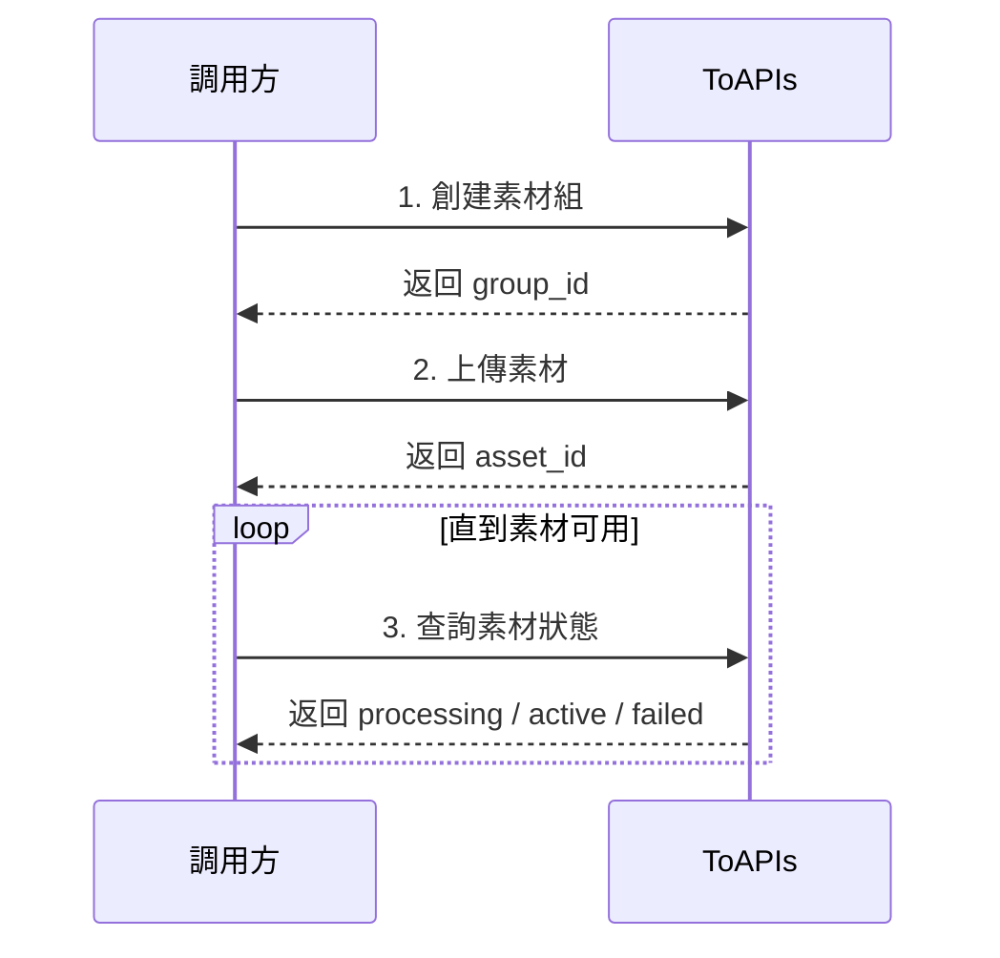

虛擬人像素材接口適用於你已經擁有可商用的虛擬角色素材，希望將這些素材提交到平臺進行審覈和處理，後續在 Seedance 2 視頻生成中穩定複用的場景。

你可以用這組接口完成三件事：

- 創建虛擬人像素材組
- 上傳圖片、視頻或音頻素材
- 查詢素材處理狀態，並在生成接口中引用

在開始接入前，你需要準備：

- 可正常訪問的公網素材 URL
- 你的 ToAPIs API Key
- 用於後續生成的視頻提示詞和素材引用方式

## Authorizations

<ParamField header="Authorization" type="string" required>
  所有請求均需要使用 Bearer Token 進行認證。

  獲取 API Key：訪問 [API Key 管理頁面](https://toapis.com/console/token)

  ```
  Authorization: Bearer YOUR_API_KEY
  ```
</ParamField>

## 接入流程



## 第一步：創建素材組

當你準備上傳一組屬於同一虛擬角色的素材時，先創建一個素材組。後續你可以把同一角色的不同素材放到同一個組裏管理。

調用接口：

- `POST /v1/videos/doubao-seedance-2-0/private-avatar/groups`

這個接口的作用：

- 創建一個新的虛擬人像素材組
- 返回後續上傳素材要使用的 `group_id`

<RequestExample>
```bash cURL
curl --request POST \
  --url https://toapis.com/v1/videos/doubao-seedance-2-0/private-avatar/groups \
  --header 'Authorization: Bearer <token>' \
  --header 'Content-Type: application/json' \
  --data '{
    "name": "brand-avatar-group",
    "description": "品牌虛擬人像素材組"
  }'
```
</RequestExample>

<ResponseExample>
```json
{
  "success": true,
  "message": "",
  "data": {
    "group_id": "group-20260318033332-*****",
    "name": "brand-avatar-group",
    "description": "品牌虛擬人像素材組"
  }
}
```
</ResponseExample>

## 第二步：上傳素材

創建好素材組後，你就可以向該組提交素材。每次請求上傳一個素材。

調用接口：

- `POST /v1/videos/doubao-seedance-2-0/private-avatar/assets`

這個接口的作用：

- 向指定的素材組提交一個素材
- 返回 `asset_id`
- 素材會進入異步處理流程

支持的 `asset_type`：

- `image`
- `video`
- `audio`

客戶真正需要關心的字段只有這些：

- `group_id`：素材組 ID
- `asset_type`：素材類型
- `source_url`：素材公網 URL
- `name`：素材名稱，可選

<RequestExample>
```bash cURL
curl --request POST \
  --url https://toapis.com/v1/videos/doubao-seedance-2-0/private-avatar/assets \
  --header 'Authorization: Bearer <token>' \
  --header 'Content-Type: application/json' \
  --data '{
    "group_id": "group-20260318033332-*****",
    "asset_type": "image",
    "source_url": "https://files.example.com/avatar-full-body.jpg",
    "name": "full-body"
  }'
```
</RequestExample>

<ResponseExample>
```json
{
  "success": true,
  "message": "",
  "data": {
    "asset_id": "asset-20260318071009-*****",
    "group_id": "group-20260318033332-*****",
    "asset_type": "image",
    "source_url": "https://files.example.com/avatar-full-body.jpg",
    "status": "processing"
  }
}
```
</ResponseExample>

## 第三步：查詢素材狀態

素材提交後不會立刻可用。你需要輪詢查詢素材狀態，直到它變成 `active`。

調用接口：

- `GET /v1/videos/doubao-seedance-2-0/private-avatar/assets/{asset_id}`

這個接口的作用：

- 查詢指定素材當前狀態
- 判斷該素材是否已經可以在視頻生成中使用

<RequestExample>
```bash cURL
curl --request GET \
  --url https://toapis.com/v1/videos/doubao-seedance-2-0/private-avatar/assets/asset-20260318071009-***** \
  --header 'Authorization: Bearer <token>'
```
</RequestExample>

<ResponseExample>
```json
{
  "success": true,
  "message": "",
  "data": {
    "asset_id": "asset-20260318071009-*****",
    "group_id": "group-20260318033332-*****",
    "asset_type": "image",
    "source_url": "https://media.example.com/processed/avatar.jpg",
    "status": "active"
  }
}
```
</ResponseExample>

## 素材要求與最佳實踐

爲了提高審覈通過率和後續生成效果，建議你優先準備高質量、無遮擋、主體明確的素材。

推薦做法：

- 使用穩定可訪問的公網 URL，不要使用臨時鏈接
- 同一虛擬角色的素材儘量放在同一素材組中
- 優先準備全身圖和麪部特寫圖，方便後續生成時保持形象一致
- 儘量避免模糊、強遮擋、多人同框、強壓縮素材

## 狀態說明

<ResponseField name="processing" type="string">
  素材已提交，平臺正在審覈和處理，暫時還不能用於生成。
</ResponseField>

<ResponseField name="active" type="string">
  素材已可用，可以在視頻生成接口中引用。
</ResponseField>

<ResponseField name="failed" type="string">
  素材處理失敗。建議檢查素材內容、清晰度、訪問 URL 是否有效，然後重新提交。
</ResponseField>

## 在視頻生成中的使用方式

當素材狀態變爲 `active` 後，你可以在視頻生成接口中使用 `asset://<ASSET_ID>` 來引用它。

調用接口：

- `POST /v1/videos/generations`

在生成請求裏，把已經可用的素材寫成 `asset://<ASSET_ID>` 即可。

```json
{
  "model": "doubao-seedance-2-0",
  "prompt": "讓圖片1中的角色站在城市夜景中緩慢轉身，鏡頭輕微推進",
  "image_with_roles": [
    {
      "url": "asset://asset-20260318071009-*****",
      "role": "reference_image"
    }
  ]
}
```

## 常見注意事項

- 上傳成功不等於素材可立即使用，必須等到 `status=active`
- 一個素材組適合同一虛擬角色，不建議把多個無關角色混在同一組
- 素材 URL 需要保持可訪問，否則會導致處理失敗
- 如果你只拿到了 `group_id`，還沒有拿到 `asset_id`，說明你還沒完成“上傳素材”這一步
