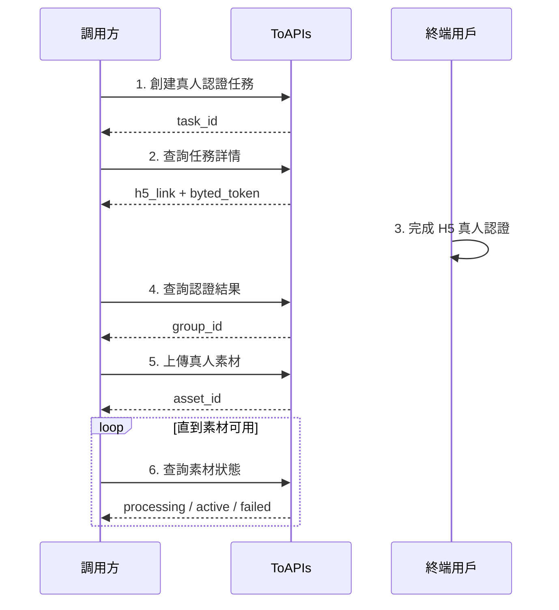

真人人像素材接口適用於你希望上傳真實人物素材，並在合規前提下用於視頻生成的場景。和虛擬人像不同，真人人像素材在提交前需要先完成真人認證。

你可以用這組接口完成完整流程：

- 創建真人認證任務
- 獲取 H5 認證鏈接
- 查詢認證結果，拿到素材組 ID
- 上傳真人素材
- 查詢素材狀態並在生成中使用

在開始接入前，你需要準備：

- 一個可接收結果參數的 `callback_url`
- 可正常訪問的公網素材 URL
- 你的 ToAPIs API Key

## Authorizations

<ParamField header="Authorization" type="string" required>
  所有請求均需要使用 Bearer Token 進行認證。

  獲取 API Key：訪問 [API Key 管理頁面](https://toapis.com/console/token)

  ```
  Authorization: Bearer YOUR_API_KEY
  ```
</ParamField>

## 接入流程



## 第一步：創建真人認證任務

你需要先創建一個真人認證任務。創建成功後，平臺會爲你準備後續查詢所需的任務信息。

調用接口：

- `POST /v1/videos/doubao-seedance-2-0/real-avatar/verify-tasks`

這個接口的作用：

- 創建一個新的真人認證任務
- 返回 `task_id`
- 後續你需要用 `task_id` 查詢認證詳情

<RequestExample>
```bash cURL
curl --request POST \
  --url https://toapis.com/v1/videos/doubao-seedance-2-0/real-avatar/verify-tasks \
  --header 'Authorization: Bearer <token>' \
  --header 'Content-Type: application/json' \
  --data '{
    "callback_url": "https://your-app.example.com/doubao/callback",
    "locale": "zh",
    "biz_id": "user-123"
  }'
```
</RequestExample>

## 第二步：查詢認證任務詳情

創建任務後，使用 `task_id` 查詢詳情，拿到 `h5_link`、`byted_token` 和 `expires_at`。

調用接口：

- `GET /v1/videos/doubao-seedance-2-0/real-avatar/verify-tasks/{task_id}`

這個接口的作用：

- 查詢真人認證任務詳情
- 獲取終端用戶要打開的 `h5_link`
- 獲取後續查詢認證結果要用的 `byted_token`

這裏有一個非常重要的區別：

- `status=completed` 僅表示認證會話已經創建成功
- 不表示真人認證已經通過

<ResponseExample>
```json
{
  "success": true,
  "message": "",
  "data": {
    "task_id": "tsk_dav_01K...",
    "status": "completed",
    "callback_url": "https://your-app.example.com/doubao/callback",
    "locale": "zh",
    "biz_id": "user-123",
    "byted_token": "202603311449168C23BA26**************",
    "h5_link": "https://h5.example.com/...",
    "expires_at": 1770000123,
    "created_at": 1770000003,
    "updated_at": 1770000004
  }
}
```
</ResponseExample>

## 第三步：用戶完成 H5 真人認證

將第二步拿到的 `h5_link` 提供給終端用戶。用戶完成認證後，你需要從 `callback_url` 回調參數中讀取：

- `resultCode`
- `bytedToken`

其中：

- `resultCode=10000` 表示認證成功

這一階段不需要額外調用素材接口，但你需要保存好：

- `resultCode`
- `bytedToken`

## 第四步：查詢認證結果

當用戶完成真人認證後，繼續調用認證結果接口，獲得後續上傳素材需要使用的 `group_id`。

調用接口：

- `GET /v1/videos/doubao-seedance-2-0/real-avatar/verify-results`

可用查詢參數：

- `task_id`
- `byted_token`
- `result_code` 推薦一併傳入

這個接口的作用：

- 確認認證是否已經通過
- 獲取後續上傳真人素材要使用的 `group_id`

推薦把回調裏的 `resultCode=10000` 一起傳入，便於你的業務流程判斷。

<RequestExample>
```bash cURL
curl --request GET \
  --url 'https://toapis.com/v1/videos/doubao-seedance-2-0/real-avatar/verify-results?task_id=tsk_dav_01K...&result_code=10000' \
  --header 'Authorization: Bearer <token>'
```
</RequestExample>

<ResponseExample>
```json
{
  "success": true,
  "message": "",
  "data": {
    "task_id": "tsk_dav_01K...",
    "byted_token": "202603311449168C23BA26**************",
    "result_code": "10000",
    "verify_status": "verified",
    "group_id": "group-20260331145705-*****"
  }
}
```
</ResponseExample>

## 第五步：上傳真人人像素材

當且僅當：

- `verify_status=verified`
- 並且已經拿到 `group_id`

你才應該繼續上傳真人素材。

`group_id` 必須來自認證成功結果，不能手動僞造，也不能複用其他用戶的真人素材組。

調用接口：

- `POST /v1/videos/doubao-seedance-2-0/real-avatar/assets`

這個接口的作用：

- 向認證通過後的真人素材組上傳一個素材
- 返回 `asset_id`
- 素材會進入異步處理流程

<RequestExample>
```bash cURL
curl --request POST \
  --url https://toapis.com/v1/videos/doubao-seedance-2-0/real-avatar/assets \
  --header 'Authorization: Bearer <token>' \
  --header 'Content-Type: application/json' \
  --data '{
    "group_id": "group-20260331145705-*****",
    "asset_type": "image",
    "source_url": "https://files.example.com/real-person-front.jpg",
    "name": "front"
  }'
```
</RequestExample>

## 第六步：查詢素材狀態

真人素材提交後同樣需要等待處理完成。你需要輪詢：

`GET /v1/videos/doubao-seedance-2-0/real-avatar/assets/{asset_id}`

直到 `status=active`。

這個接口的作用：

- 查詢指定真人素材當前狀態
- 判斷該素材是否已經可以在視頻生成中使用

## 狀態說明

<ResponseField name="processing" type="string">
  素材已提交，正在審覈和處理，暫時還不能用於生成。
</ResponseField>

<ResponseField name="active" type="string">
  素材已可用，可以在視頻生成接口中引用。
</ResponseField>

<ResponseField name="failed" type="string">
  素材處理失敗。建議檢查認證狀態、素材 URL、素材內容與認證人物的一致性後重新提交。
</ResponseField>

## 在視頻生成中的使用方式

當素材狀態變爲 `active` 後，你可以在視頻生成接口中通過 `asset://<ASSET_ID>` 引用：

調用接口：

- `POST /v1/videos/generations`

```json
{
  "model": "doubao-seedance-2-0",
  "prompt": "讓圖片1中的人物在室內鏡頭前自然微笑，並做輕微點頭動作",
  "image_with_roles": [
    {
      "url": "asset://asset-20260318071009-*****",
      "role": "reference_image"
    }
  ]
}
```

## 常見失敗原因

- H5Link 已過期，用戶未在有效時間內完成認證
- 用戶尚未完成真人認證，就提前查詢結果
- 認證已完成，但你的業務側沒有繼續查詢認證結果獲取 `group_id`
- 上傳的素材與認證人物不一致，導致審覈失敗
- 素材 URL 無法訪問或素材質量過低
