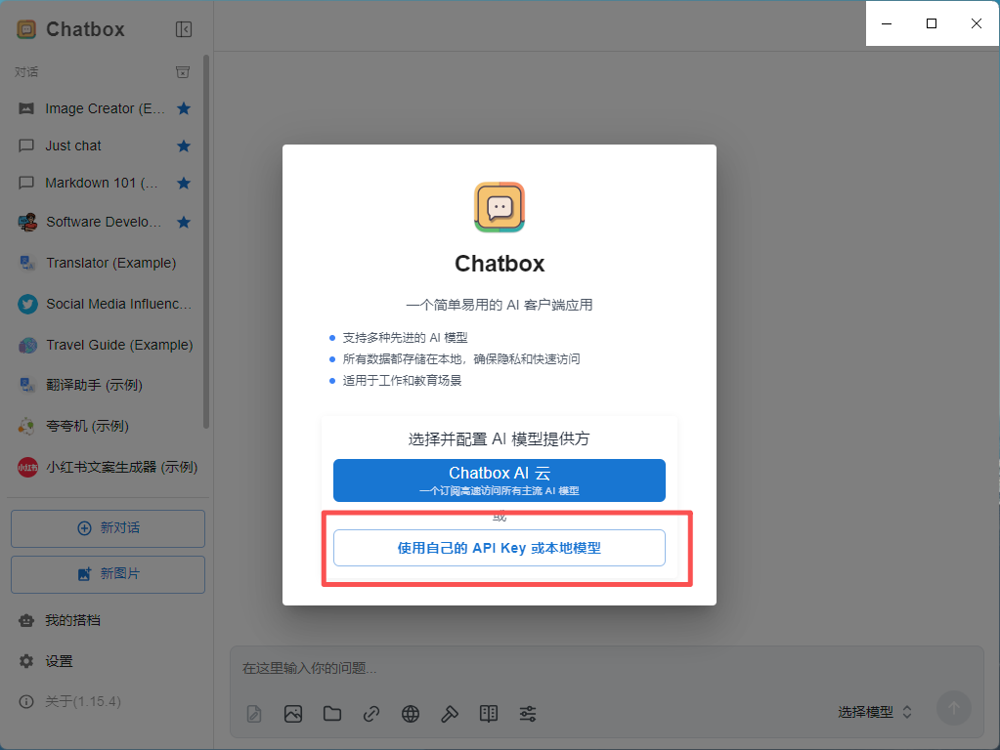
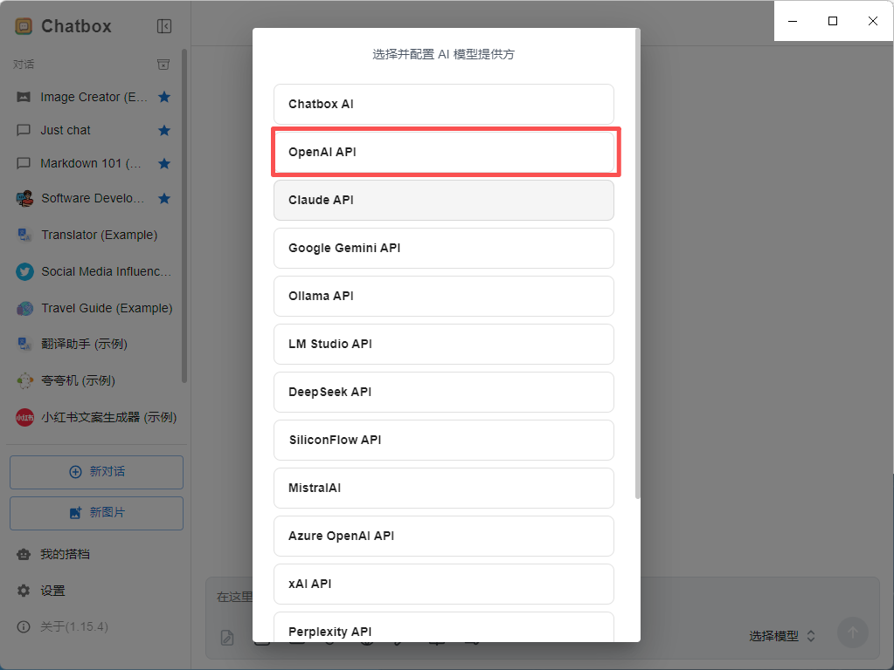
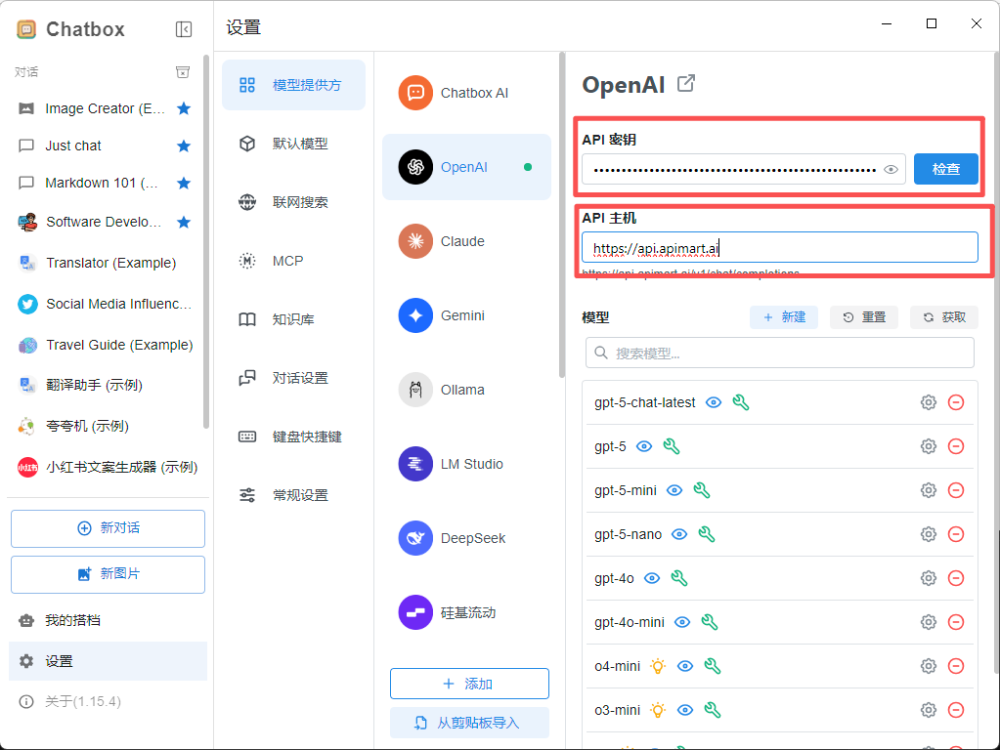
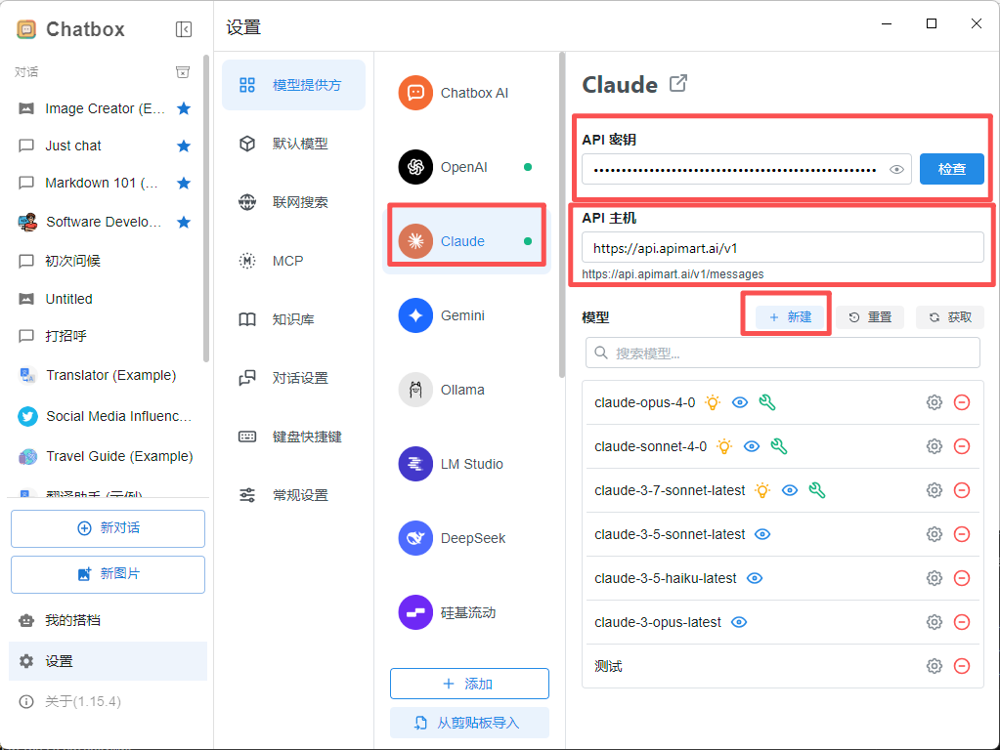
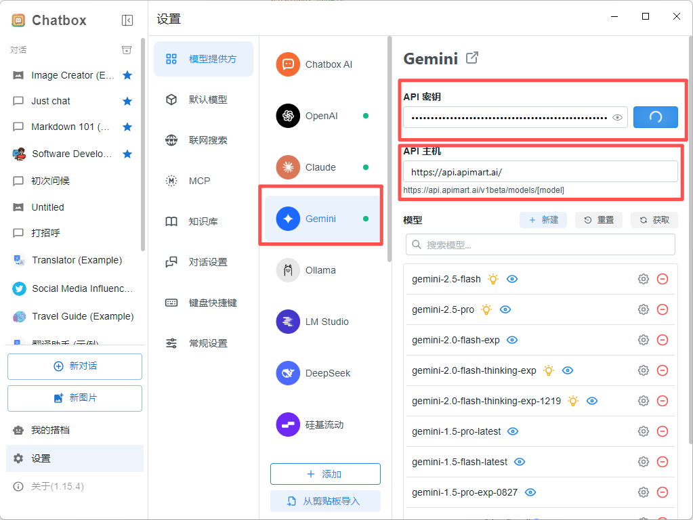
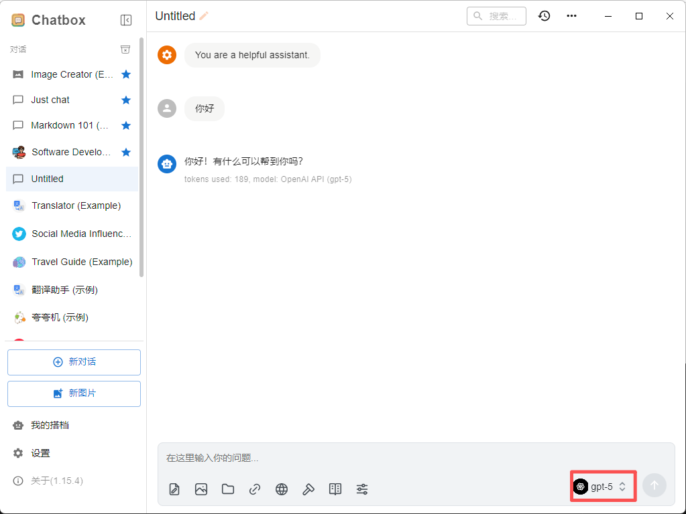

## [​](#準備工作)準備工作

在開始之前，請確保：

1. **已安裝 ChatBox**

   從 [ChatBox GitHub](https://github.com/Bin-Huang/chatbox) 下載並安裝適合您操作系統的版本，或訪問 [ChatBox 官網](https://chatboxai.app/)
2. **已獲取 ToAPIs API 密鑰**

   登錄 [ToAPIs 控制檯](https://toapis.com/console/token) 獲取您的 API 密鑰（以 `sk-` 開頭）

**提示：** 如果還沒有 ToAPIs 賬戶，請先在 [ToAPIs](https://toapis.com) 註冊並獲取 API 密鑰。
## [​](#第一步：啓動-chatbox-並開始配置)第一步：啓動 ChatBox 並開始配置

首次啓動 ChatBox 或添加新的 AI 提供商時：

1. 啓動 ChatBox 應用
2. 如果是首次使用，會自動彈出配置嚮導
3. 點擊 **“使用自己的 API Key 或本地模型”** 按鈕
4. 如果已經配置過，可以點擊左下角的 **⚙️ 設置** 圖標，或使用快捷鍵 `Ctrl+,` (Windows/Linux) / `Cmd+,` (macOS)


## [​](#第二步：配置-ToAPIs-api)第二步：配置 ToAPIs API

### [​](#2-1-選擇-ai-模型提供商)2.1 選擇 AI 模型提供商

在設置頁面中：

1. 找到 **AI 模型提供商** 或 **AI Provider** 設置項
2. 在下拉菜單中選擇 **OpenAI API**（使用 GPT 系列模型）、**Claude API**（使用 Claude 系列模型）或 **Gemini API**（使用 Gemini 系列模型）


### [​](#2-2-配置-api-信息)2.2 配置 API 信息

選擇 **OpenAI API** 後，填寫以下配置信息：

| 配置項 | 填寫內容 |
| --- | --- |
| **API Key** | 您的 ToAPIs API 密鑰（`sk-xxxxxxxxxxxx`） |
| **API Host** 或 **API Domain** | `https://toapis.com` |



選擇 **Claude API** 後，填寫以下配置信息：

| 配置項 | 填寫內容 |
| --- | --- |
| **API Key** | 您的 ToAPIs API 密鑰（`sk-xxxxxxxxxxxx`） |
| **API Host** 或 **API Domain** | `https://toapis.com/v1` |



選擇 **Gemini API** 後，填寫以下配置信息：

| 配置項 | 填寫內容 |
| --- | --- |
| **API Key** | 您的 ToAPIs API 密鑰（`sk-xxxxxxxxxxxx`） |
| **API Host** 或 **API Domain** | `https://toapis.com/` |



**重要提示：**

- 使用 OpenAI API 時，API Host 應填寫 `https://toapis.com`（不包含 `/v1` 後綴）
- 使用 Claude API 時，API Host 應填寫 `https://toapis.com/v1`（包含 `/v1` 後綴）
- 使用 Gemini API 時，API Host 應填寫 `https://toapis.com/`（不包含 `/v1` 後綴）
- API Key 必須是從 ToAPIs 控制檯獲取的以 `sk-` 開頭的密鑰
- 確保您的 API 密鑰有足夠的餘額
### [​](#2-3-選擇模型)2.3 選擇模型

配置完成後，在 **模型** 或 **Model** 下拉菜單中選擇您要使用的模型：
**推薦模型：**

| 模型名稱 | 模型 ID | 特點 |
| --- | --- | --- |
| GPT-5 | `gpt-5` | 最新最強大的模型 |
| GPT-4o | `gpt-4o` 或 `chatgpt-4o-latest` | 高質量對話 |
| GPT-4o Mini | `gpt-4o-mini` | 快速且經濟 |
| Claude Sonnet 4.5 | `claude-sonnet-4-5-20250929` | 擅長代碼和推理 |
| Claude Haiku 4.5 | `claude-haiku-4-5-20251001` | 快速響應 |
| Gemini 2.0 Flash | `gemini-2.0-flash-exp` | 多模態支持 |


**使用 Claude 模型的特殊說明：**如果您選擇使用 Claude 模型（如 `claude-sonnet-4-5-20250929` 或 `claude-haiku-4-5-20251001`），需要進行以下額外配置：

1. **切換到 Claude API 提供商**：
   - 在設置中將 **AI 模型提供商** 改爲 **Claude API**
   - API Host 保持填寫 `https://toapis.com/v1`
   - API Key 使用您的 ToAPIs API 密鑰（`sk-xxxxxxxxxxxx`）
2. **或者添加自定義請求頭**（如果使用 OpenAI API 提供商）：
   - 某些版本的 ChatBox 支持添加自定義 Headers
   - 在高級設置中添加請求頭：`anthropic-version: 2023-06-01`

**推薦方式：** 使用 GPT 系列模型時選擇 **OpenAI API**，使用 Claude 系列模型時選擇 **Claude API**，使用 Gemini 系列模型時選擇 **Gemini API**。
**性能建議：**

- 💰 **高性價比：** `gpt-4o-mini`、`claude-haiku-4-5-20251001`
- 🚀 **高性能：** `gpt-5`、`gpt-4o`、`claude-sonnet-4-5-20250929`
- ⚡ **快速響應：** `gemini-2.0-flash-exp`、`gpt-4o-mini`
## [​](#第三步：開始使用)第三步：開始使用

配置完成後，您就可以開始使用 ChatBox 與 AI 對話了：

1. 返回主界面
2. 在輸入框中輸入您的問題或需求
3. 按 `Enter` 或點擊發送按鈕
4. AI 將使用 ToAPIs 的模型爲您生成回覆


### [​](#調整模型參數（可選）)調整模型參數（可選）

您可以根據需要調整以下參數：

| 參數 | 說明 | 推薦值 |
| --- | --- | --- |
| **Temperature** | 控制輸出隨機性 | 0.7（創意）/ 0.3（精確） |
| **Max Tokens** | 最大輸出長度 | 2000-4000 |
| **Top P** | 核採樣參數 | 0.9 |

## [​](#高級功能)高級功能

### [​](#多會話管理)多會話管理

ChatBox 支持創建多個對話會話：

1. 點擊 **新建對話** 按鈕
2. 可以爲不同的任務創建獨立的會話
3. 在左側會話列表中切換不同的對話

### [​](#保存和導出對話)保存和導出對話

1. 右鍵點擊對話會話
2. 選擇 **導出** 選項
3. 可以導出爲 Markdown、JSON 等格式

### [​](#使用提示詞模板)使用提示詞模板

1. 在設置中找到 **提示詞** 或 **Prompts** 設置
2. 可以保存常用的提示詞模板
3. 在對話中快速調用預設的提示詞

## [​](#常見問題)常見問題

### [​](#q1:-無法連接到-ToAPIs-服務？)Q1: 無法連接到 ToAPIs 服務？

**解決方案：**

1. **檢查 API Host**：
   - 確保填寫的是 `https://toapis.com`
   - 不要添加 `/v1` 或其他路徑
2. **驗證 API Key**：
   - 確認 API Key 正確且以 `sk-` 開頭
   - 在 [ToAPIs 控制檯](https://toapis.com/console/token) 檢查密鑰是否有效
3. **檢查網絡連接**：
   - 確保能夠訪問 `https://toapis.com`
   - 如果在國內，可能需要配置代理

### [​](#q2:-模型列表中沒有顯示-ToAPIs-的模型？)Q2: 模型列表中沒有顯示 ToAPIs 的模型？

**解決方案：**

1. **手動輸入模型名稱**：
   - 在模型輸入框中直接輸入模型 ID
   - 例如：`gpt-4o`、`gpt-4o-mini`、`claude-sonnet-4-5-20250929`
2. **刷新模型列表**：
   - 重啓 ChatBox 應用
   - 重新配置 API 信息

### [​](#q3:-對話時出現錯誤提示？)Q3: 對話時出現錯誤提示？

**常見錯誤及解決方案：**

| 錯誤信息 | 原因 | 解決方法 |
| --- | --- | --- |
| `401 Unauthorized` | API Key 無效或過期 | 重新獲取 API Key 並更新配置 |
| `429 Too Many Requests` | 請求頻率超限 | 稍等片刻後重試 |
| `500 Internal Server Error` | 服務器臨時故障 | 等待幾分鐘後重試 |
| `insufficient_quota` | 賬戶餘額不足 | 前往控制檯充值 |

### [​](#q4:-如何查看-api-使用情況和費用？)Q4: 如何查看 API 使用情況和費用？

登錄 [ToAPIs 控制檯](https://toapis.com/console) 查看：

- 📊 API 調用統計
- 💰 費用明細
- 📈 使用趨勢圖表
- 🔍 詳細的請求日誌

### [​](#q5:-chatbox-支持哪些平臺？)Q5: ChatBox 支持哪些平臺？

ChatBox 支持多個平臺：

- 🪟 **Windows** - Windows 10/11
- 🍎 **macOS** - macOS 10.15+
- 🐧 **Linux** - 各主流發行版
- 🌐 **Web** - 瀏覽器版本

## [​](#使用技巧)使用技巧

### [​](#1-快捷鍵)1. 快捷鍵

充分利用 ChatBox 的快捷鍵提升效率：

| 快捷鍵 | 功能 |
| --- | --- |
| `Ctrl/Cmd + Enter` | 發送消息 |
| `Ctrl/Cmd + N` | 新建對話 |
| `Ctrl/Cmd + K` | 搜索對話 |
| `Ctrl/Cmd + ,` | 打開設置 |
| `Ctrl/Cmd + /` | 顯示快捷鍵幫助 |

### [​](#2-優化提示詞)2. 優化提示詞

編寫更好的提示詞以獲得更好的回覆：
**❌ 不好的提示：**
複製
```shiki
幫我寫代碼

```

**✅ 好的提示：**
複製
```shiki
請幫我用 Python 編寫一個函數，實現以下功能：
1. 接收一個字符串列表作爲輸入
2. 過濾掉長度小於 3 的字符串
3. 返回按字母順序排序的結果
請包含詳細註釋和示例用法

```
### [​](#3-利用對話歷史)3. 利用對話歷史

ChatBox 會保存對話歷史：

- AI 會記住當前會話中的上下文
- 可以基於之前的回答繼續提問
- 適合進行深入的探討和迭代

### [​](#4-切換模型)4. 切換模型

根據不同任務切換合適的模型：

- **寫作任務** - 使用 `gpt-4o` 或 `claude-sonnet-4-5`
- **代碼任務** - 使用 `claude-sonnet-4-5`
- **快速問答** - 使用 `gpt-4o-mini`
- **多模態** - 使用 `gemini-2.0-flash-exp`

## [​](#功能特性)功能特性

使用 ChatBox + ToAPIs，您可以：

- 💬 **流暢對話** - 實時流式輸出，體驗更流暢
- 🎯 **多會話管理** - 同時管理多個獨立對話
- 💾 **本地存儲** - 對話記錄保存在本地，保護隱私
- 📤 **導出對話** - 支持多種格式導出對話記錄
- 🎨 **界面簡潔** - 簡潔美觀的用戶界面
- 🔒 **開源免費** - 完全開源，免費使用
- 🌍 **跨平臺** - 支持 Windows、macOS、Linux
- 🚀 **性能優秀** - 輕量級應用，運行流暢

## [​](#支持與幫助)支持與幫助

如果您在使用過程中遇到任何問題：

- 📚 [ToAPIs 文檔中心](https://docs.toapis.com)
- 📚 [ChatBox GitHub](https://github.com/Bin-Huang/chatbox)
- 💬 [Discord 社區](https://discord.gg/hvnszCrJ73)
- 🐦 [Twitter @toapisai](https://x.com/toapisai)
- 📧 技術支持：[zhihong@toapis.com](mailto:zhihong@toapis.com)

---


<CardGroup cols={2}>
  <Card title="開始使用 ToAPIs" icon="rocket" href="https://toapis.com">
    立即註冊 ToAPIs，獲取您的 API 密鑰，在 ChatBox 中開啓 AI 之旅。
  </Card>
  <Card title="在 Cherry Studio 中使用 ToAPIs" icon="book" href="./cherry-studio">
    配置另一個 OpenAI 兼容客戶端。
  </Card>
</CardGroup>
